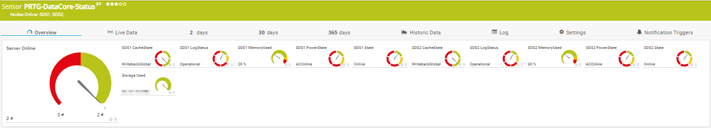
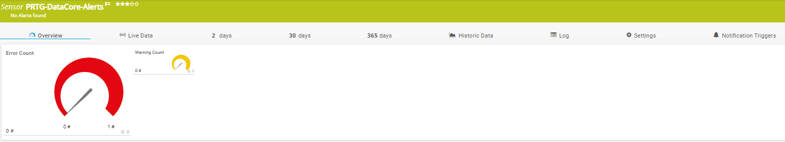
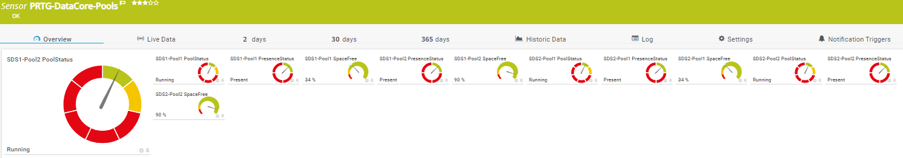
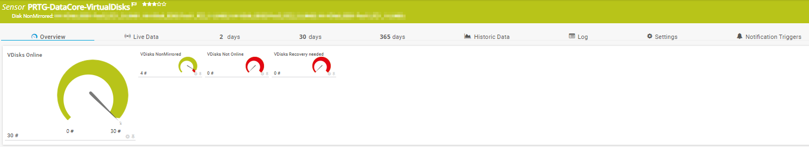

# PRTG-DataCore
# About

## Project Owner:

Jannos-443

## Project Details

This Script can monitor DataCore.

## HOW TO
1. Install `DataCorePowershellSupport-XXXXX.exe` on the Probe(s) 

2. Make sure the DataCore Powershell Module exists on the Probe under the following Path
   - `C:\Program Files\DataCore\Powershell Support\DataCore.Executive.Cmdlets.dll`

3. Place the Scripts under `C:\Program Files (x86)\PRTG Network Monitor\Custom Sensors\EXEXML`

4. Create new Sensor

   | Settings | Value |
   | --- | --- |
   | EXE/Script | PRTG-DataCore-XXX.ps1 |
   | Parameters | -DcsServer 'YourDataCoreServer'|
   | Scanning Interval | 15 minutes |

if required use the -User and -Password parameter.

## Examples
Example Call: 

    PRTG-DataCore-Alerts.ps1 -DcsServer 'YourDataCoreServer' (Windows Auth) <- better 
    PRTG-DataCore-Alerts.ps1 -DcsServer 'YourDataCoreServer' -User 'YourUsername' -Password 'YourPassword' (Username and Password)
    
PRTG-DataCore-Status

PRTG-DataCore-Alerts

PRTG-DataCore-Pools

PRTG-DataCore-Ports

PRTG-DataCore-VirtualDisks

